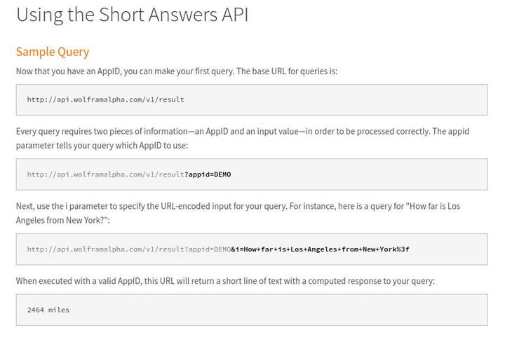
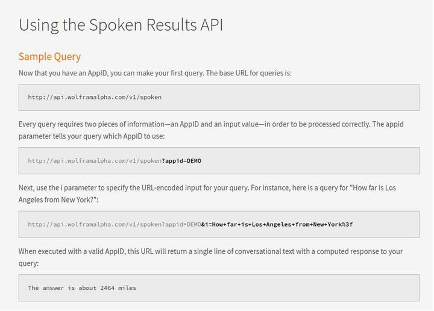
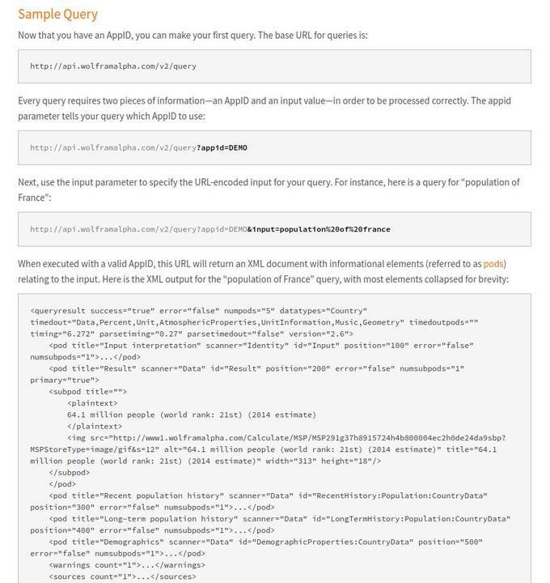

# Wolfman | Amazon Alexa Wolfram Alpha Skill

**Author**:

- Beverly Pham [Git Hub](https://github.com/zarkle) | [Linkedin](https://www.linkedin.com/in/beverly-pham/)
- Keith Eckert [Git Hub](https://github.com/keitheck) | [Linkedin](www.linkedin.com/in/keith-eckert)
- Peter Kim [Git Hub](https://github.com/seattlechem) | [Linkedin](https://www.linkedin.com/in/seattlechem/)
- Andrii Glukhyi [Git Hub](https://github.com/andriiglukhyi) | [Linkedin](https://www.linkedin.com/in/andrii-glukhyi-961b17156/)

**Version**: 0.1.0

## Overview

- Wolfman is an Alexa Skill with an AWS Lambda function to query multiple Wolfram Alpha API's.

- The technology that drives voice user interfaces like Amazon's Alexa devices is really exciting.  At this time however, the domain of answerable questions in the default software is still fairly limited.  We set out to build an Alexa voice application that could correctly answer computational domain questions that the base Alexa frequently cannot answer.  For example, if you ask Alexa a simple algebraic question such as "Alexa, solve x plus two equals 10" you will get a response that she "didn't get that," or similar.  Asking any slightly more complex algebraic questions such as "Alexa, solve x plus y equals ten and x minus y equals four," is not answered by Alexa.

- One of the goals of Wolfman was to try to avoid a linear feel to the user experience where the same voice cues are repeated in each question / answer cycle.  Voice cues and response prefixes/suffixes are randomly selected to add a dynamic, more lifelike interaction with the Wolfman app.

- Wolfram Alpha offers multiple API endpoints, each with different functionalities. Our original intent was to use only the Short Answer API, but the scope of what this API could respond to was not as thorough as we desired.  In the end, we used three of the API's in this build ('Short Answers API', 'Spoken Results API', 'Full Results API'). If the answer to a user question is not available at the first API, we send a GET request to the second, then the third. In this flow, we are able to handle a majority of user questions outside of the original project intent, effectively mimicking the core Alexa functionality while adding computational abilities.

## Architecture

- Languages: Python 3, HTML, CSS
- Technologies: Pyramid, Wolfram Alfpha API's, Amazon Lamba, Amazon Alexa, DynamoDb, Heroku, Travis CI, SQLAlchemy

## Getting Started

We welcome you to fork and refine Wolfman.

1. Go to https://developer.wolframalpha.com/portal/signin.html and request access to the Wolfram API's.

2. Create a new Alexa skill here: https://developer.amazon.com/alexa-skills-kit

    - Under Invocation, enter `wolfman` in the Skill Invocation Name field.
    - In the JSON Editor tab, copy the contentes of the file `alexa_skill_json.txt` in the `alexa` directory on this repo.
    - You should now have populated the items under the Intents tab.  You may select the wolfman intent and add more sample utterances in the format `wolfman {sample question|response}`.
    - Save the model and select click on 'Build Model'.

3. Create an Amazon Web Services 'AWS' Account.

    - Open an new Lambda function and copy/paste the contents of the lambda.py file from the 'alexa' directory.
    - From your Alexa Skill, under the Endpoints tab, locate 'Your Skill ID' and copy it to your clipboard.
    - Create two environmental variables, one called `SKILL_ID` and enter the id of the alexa skill you will create in the next step. Second create `WOLFRAM_ID` and enter the appid given when signing up for access for the Wolfram API's.

4. In the same Amazon Developer account, login to https://alexa.amazon.com.

    - add an Alexa device to your account.
    - under the 'Skills' tab, select 'Your Skills'
    - Select the 'Dev Skill' and add your skill.

5. Open your Alexa and say 'Open Wolfman'.  Have fun!

6. Pyramid website with results

    - We built a website using Pyramid to tap into our DynamoDb to display all questions and answers asked through the Wolfman skill.  The code is available in the repo under the 'dot_dot_dot' directory.  This project is deployed to Heroku at https://dot-dot-dot-.herokuapp.com/

## API

- Wolfram Alpha API's are awesome.  We highly recommend tapping into this resource.
- Go to https://developer.wolframalpha.com/portal/signin.html and request access to the Wolfram API's.

    

    

    

## Change Log

| Date | |
|:--|:--|
| 4-19-2018 | Bug fixes, Documents written, testing |
| 4-18-2018 | Create and deploy AWS API Gateway, make front end and deploy on Heroku |
| 4-17-2018 | Connect Alexa Skill with AWS Lambda Function, Create DynamoDB  and connect to Lambda function |
| 4-16-2018 | Lambda function written, Skill Kit Wolfman skill built |
| 4-15-2018 | Initial Scaffold |

## Resources

- Amazon Alexa Skills Developer Kit
- Wolfram Alpha API
- Amazon API Gateway
- Amazon DynamoDB
- coggle.it
- coolors.co/
- github.com/necolas/normalize.css
- github.com/n8henrie/alexa-wolfram-alpha
- Google Fonts
- gitignore.io
